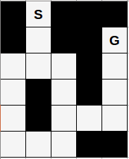
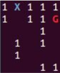
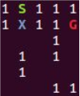
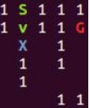
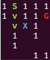
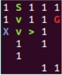
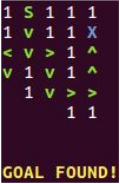
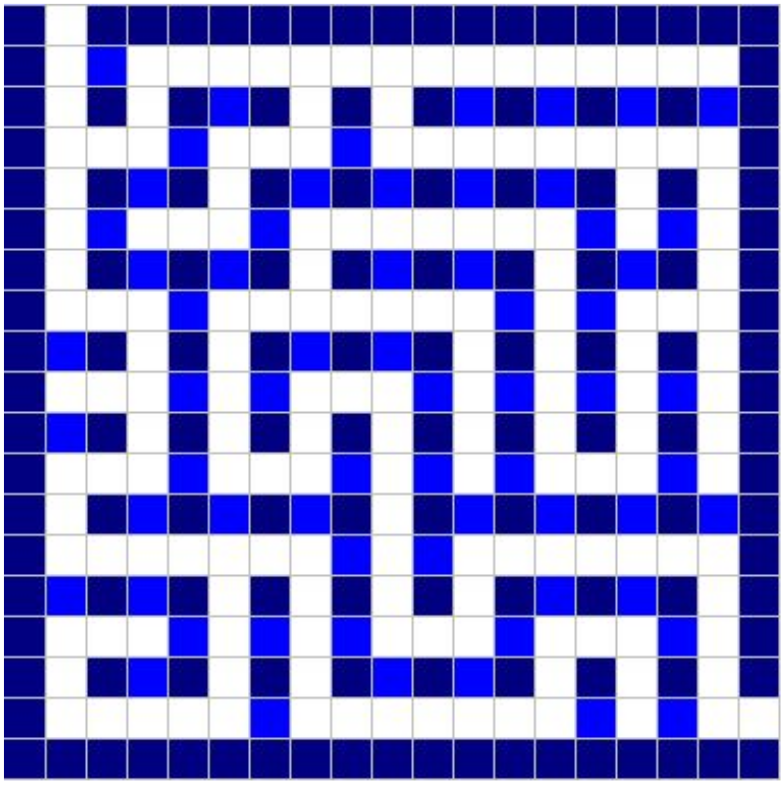
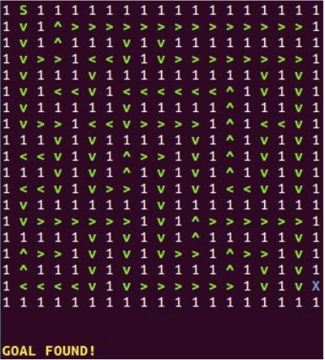

# A* for solving mazes

In our previous assignment, we saw how Depth First Search could be used doing an
uninformed search to find a solution for the famous 8 puzzle, expanding to all possible
moves and finding the correct sequence that gets us from our initial state to our desired final
state. Now, we’re going to dive into a way of doing informed search: the __A* algorithm__. </br>
</br>
What makes this algorithm different is that at each step of the process, it uses some sort of
heuristic to determine the best decision path out of all that are available. In particular, we’ll
use this approach to find the solution for an arbitrary-size maze. </br>
</br>
 </br>
</br>
So, if we consider the maze above, the solution for getting from our starting point (S) to our
goal (G) would be to follow the path: ```down, down, right, down, down, right, right, up, up, up.```</br>
This heuristic in this case is going to be the result of adding up two numbers: the depth of
our tree at that point and the total amount of squares horizontally and vertically that we’re
away from our goal, without trying to avoid obstacles. So, for example... at first we have no
other path but to follow the sequence: ```down, down```. But then, we must choose between ```left``` and
```right```. And we calculate the heuristics for each. Both are at depth 3 of our tree, but ```left``` is a total
of 5 squares away from our goal (4 horizontal, 1 vertical) and ```right``` is just a total of 3 squares
away (2 horizontal, 1 vertical). So then, we choose the option with the **lowest heuristic**: ```right```. </br>
</br>
The way we do this is by having a min heap, and every time we’re faced with several
options, we add to this heap all the new options we’ve found and we go for the least
expensive one. </br>
</br>
I’ve implemented this in C++, with full flexibility for playing around with any N x M maze. For
solving the puzzle above, I've included the following text file: </br>
```
1 S 1 1 1
1 0 1 1 G
0 0 0 1 0
0 1 0 1 0
0 1 0 0 0
0 0 0 1 1
```
Each *0* stands for a square through which you can move, each *1* for an obstacle, one *S* for
the starting point and one *G* for the goal. The program also shows each step of the process
with delayed console outputs, for which you can specify the amount of seconds you want of
delay.
The outputs of my program for this maze look as follows: </br>
</br>
 </br>
 </br>
 </br>
 </br>
 </br>
(...) </br>
Until the goal is found and we end up with: </br>
 </br>
</br>
As you can see, for every step of the process, we have all this information:
- “X” marks the square we currently are in
- “G” marks our desired destination
- all blank squares are squares through which we can walk through
- we have one of four symbols for indicating the direction we came from in order to
reach a certain square
  - “<”: right
  - “>”: left
  - “^”: down
  - “v”: up </br>
</br>```Compiling```
the program, with a compiler that supports the C+11 std:
**g++ -o maze.exe a_star_maze.cpp**
Executing the program for an arbitrary maze configuration:
```
./maze.exe <file_name>.txt <# of rows> <# of columns> <# of delay
seconds>

./maze.exe labyrinth1.txt 6 5 1
```
And there’s also another labyrinth configuration included for the following maze: </br>
 </br>

To run the program for this second maze, the command needed is:
```
./maze.exe labyrinth2.txt 19 19 1
```
Looking at the solution for this second maze is quite interesting: </br>
 </br>
