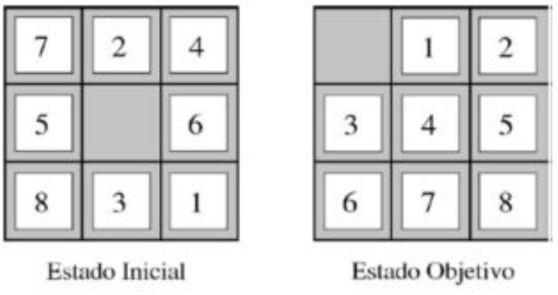

# Uninformed Breadth First Search
Here we are going to talk about the breadth first search algorithm and how it can help us find
a solution for the classic 8-puzzle. </br>
 </br>
</br>
Basically, we’ll start at some initial state and, with a series of tile movements, we will reach
the desired final state: </br>
 </br>
</br>
The BFS algorithm is going to help us find all possible moves branching off from our initial
state. By exploring all of these possible moves and their respective branches of further
moves, we are guaranteed to find a path to the solution. There MUST exist a combination of
moves that get me from my initial state to the desired final state. We will do this choosing the
brute-force approach for now, using simply the BFS algorithm as is, without any heuristics to
improve performance. That’s why we call this an uninformed BFS. </br>
The configuration for our initial state is entered in a text file, ​ input.txt ​ (0 to 8 separated by a
space, zero represents the space in 8-puzzle). The first thing the program does is print what
out initial state looks like. </br>
```
8 puzzle program

initial tiles:
[7] [2] [4]
[5] [ ] [6]
[8] [3] [1]
724506831
```
Then it runs through the tree looking for the solution. For every node visited, it outputs a dot
(“.”). So, in most cases this means lots of dots.
```
looking for solution...
...................................................................
```
Once the program finds that a certain move gets us to the desired final state, it will start
tracing back the steps that led to it, all the way back to the initial state. Then, it will display
these movements in reverse order so that you can follow them to solve the puzzle! </br>
</br>
For our initial and desired final states mentioned here, the program outputs the solution
steps as follows:
```
----------SOLUTION FOUND!----------

step #1: LEFT
step #2: UP
step #3: RIGHT
step #4: DOWN
step #5: RIGHT
step #6: DOWN
step #7: LEFT
step #8: LEFT
step #9: UP
step #10: RIGHT
step #11: RIGHT
step #12: DOWN
step #13: LEFT
step #14: LEFT
step #15: UP
step #16: RIGHT
step #17: RIGHT
step #18: UP
step #19: LEFT
step #20: LEFT
step #21: DOWN
step #22: RIGHT
step #23: RIGHT
step #24: UP
step #25: LEFT
step #26: LEFT

DEPTH of solution: 27
expanded visited nodes: 175326
elapsed program execution time: 3.139061 seconds
```
As you can see, it also shows at what depth of the tree the solution was found, how many
nodes had to be visited, how long the program took to run and a calculation of how much
memory was used. </br>
</br>
To execute this program on your own, you will need a C++ compiler that supports the C++11
standard. Once you’re in the directory where you unzipped all the files included here, you
could just run:
```
g++ -o puzzle_8.exe 8_puzzle_uninformed_BFS.cpp
```
This will compile the source code into an executable program called __puzzle_8__. Once this
finishes, this program can just simply be executed:
```
./puzzle_8.exe
```
And you should start seeing all of the program’s output explained previously. If you want to
run the program for a different initial configuration, just modify the contents in **input.txt**.
There’s no need to compile again, since only the txt file would be changed.
